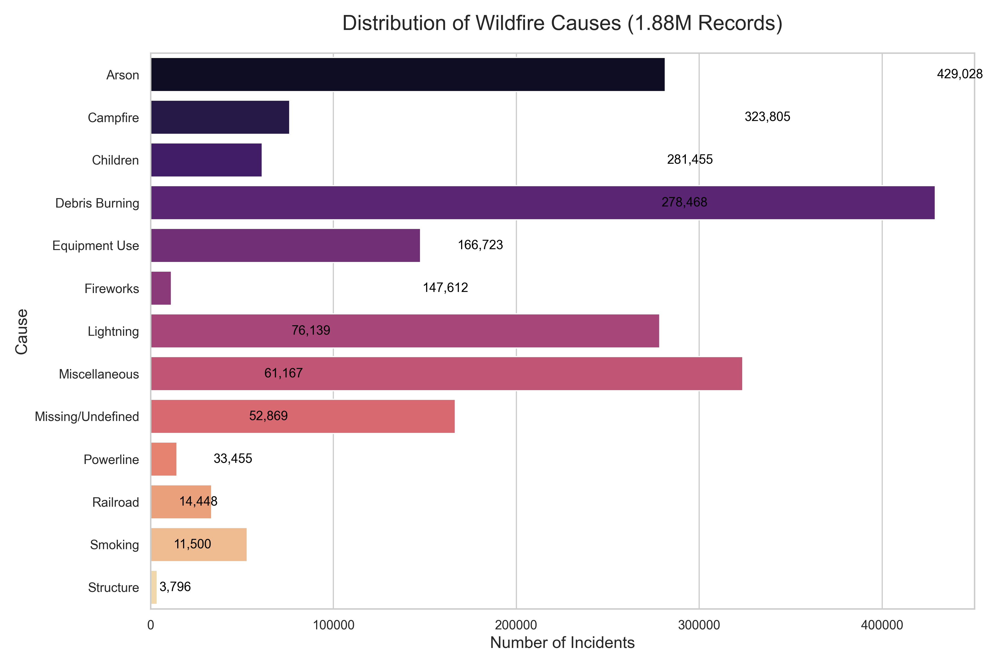

# US Wildfires Analysis: Data Optimization & Memory Management 📉🔥

## 🇺🇸 English Version
###  Project Overview
This project focuses on exploring the **1.88 Million US Wildfires** dataset. The primary goal is to demonstrate advanced data manipulation techniques using **Pandas**, specifically focusing on **Memory Management** and **Data Efficiency** when working with large-scale datasets on resource-constrained hardware (standard laptops).

## 🛠️ Technical Challenges & Solutions

### Handling Large Data on Limited Hardware
**Challenge:** Processing a 1.88 million row SQLite database (800MB+) on a machine with only 4GB of RAM.
**Solution:** 1. **Direct SQL Querying:** Avoided loading unnecessary columns to save initial memory.
2. **Data Type Optimization:** Converted strings to `category` types and downcasted 64-bit numbers to `int16` and `float32`.
3. **Storage Efficiency:** Migrated from CSV/SQLite to **Parquet** format, preserving memory-efficient types and achieving an **87% reduction** in memory footprint (from 285MB to 35MB).

###  Optimization Techniques
* **Feature Selection:** Loading only essential columns using `usecols`.
* **Data Downcasting:** Converting data types to save up to 70% of RAM.
* **Chunk Processing:** Processing the dataset in smaller batches to prevent memory overflow.

### 🚀 Quick Start
🚀 Quick Start
To replicate this project on your local machine:

Clone the repository:

Bash

git clone https://github.com/rodaalfin/efficient-pandas-wildfires.git
cd efficient-pandas-wildfires
Setup Environment:

Bash

python -m venv .venv
# Activate on Windows:
.venv\Scripts\activate
pip install -r requirements.txt
Data Preparation: Ensure the original SQLite database (FPA_FOD_20170508.sqlite) is in the root folder, then run the optimization script to generate the high-performance Parquet file:

Bash

python process_wildfires.py
Run Analysis & Visualization:

Bash

python analyze_wildfires.py
python visualize_wildfires.py

---

## 🇮🇩 Versi Bahasa Indonesia

  
<b>Klik untuk melihat detail (Bahasa Indonesia)</b>

  ###  Ikhtisar Proyek
  Proyek ini berfokus pada eksplorasi dataset **1,88 Juta Kebakaran Hutan di AS**. Tujuan utamanya adalah mendemonstrasikan teknik manipulasi data tingkat lanjut menggunakan **Pandas**, khususnya pada **Manajemen Memori** dan **Efisiensi Data** saat bekerja dengan dataset skala besar di perangkat dengan spesifikasi terbatas.

  ###  Teknik Optimasi yang Digunakan
  * **Pemilihan Fitur (Feature Selection):** Memuat kolom penting saja menggunakan `usecols`.
  * **Downcasting Data:** Mengubah tipe data untuk menghemat penggunaan RAM hingga 70%.
  * **Pemrosesan Bertahap (Chunking):** Membaca dataset dalam potongan kecil untuk menghindari kelebihan beban memori.

---
*Developed as part of my Data Science journey. "Large data, smart solutions."*